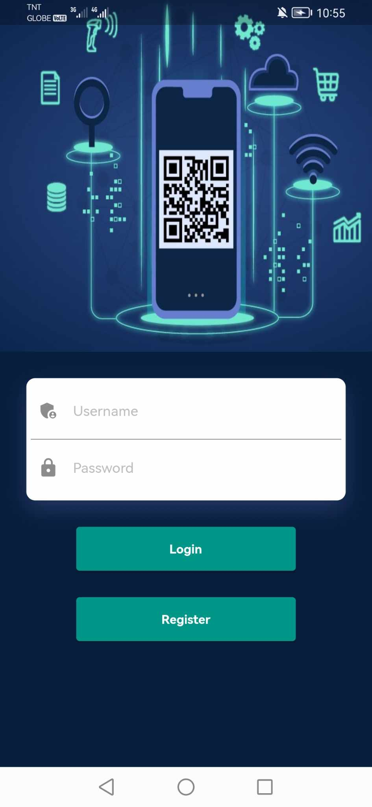
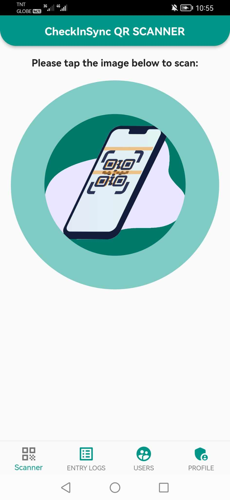
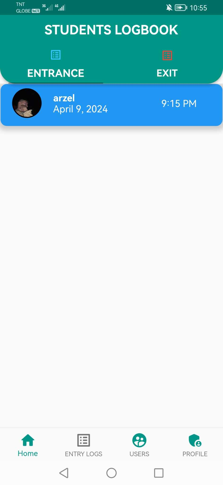
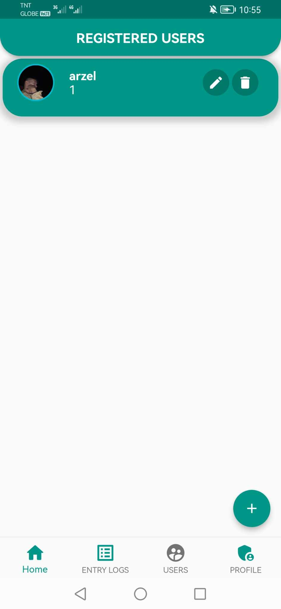
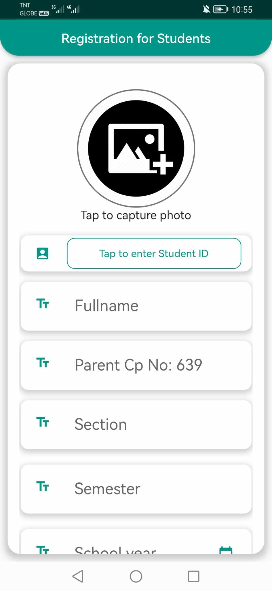
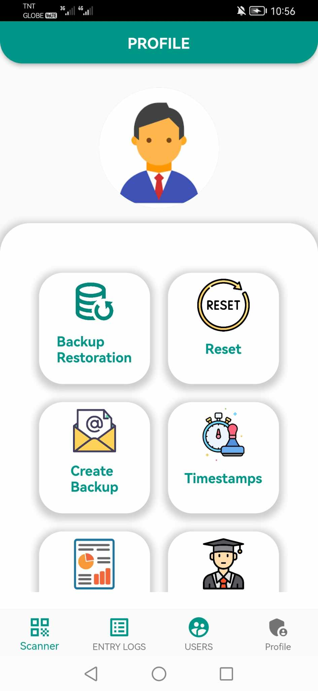

# Classroom Attendance System using QR Code Technology

## Table of Contents

- [Introduction](#introduction)
- [User - Prof/Instructor](#prof-instructor)
- [Features](#features)
- [Instructor Module](#instructor-module)
- [Demo Link](#demo)

## Introduction

Welcome to the Mobile App Classroom Attendance System (CAS) utilizing cutting-edge QR Code Technology. This system revolutionizes the traditional method of taking attendance in classrooms by integrating QR code scanning capabilities into a user-friendly mobile application.

Gone are the days of manual attendance tracking and cumbersome paperwork. With CAS, professors and instructors can effortlessly manage student attendance with a simple scan of QR codes generated for each class session. This innovative approach not only enhances efficiency but also ensures accuracy and reliability in attendance records.

By harnessing the power of QR code technology, CAS provides a seamless experience for both educators and students. Professors can easily monitor attendance, generate comprehensive reports, and facilitate communication with students and parents, all within a single platform. Meanwhile, students benefit from a streamlined attendance process that minimizes the risk of errors and promotes accountability.

Whether you're a seasoned educator looking to modernize your classroom management techniques or a technology enthusiast eager to explore the possibilities of QR code integration, CAS is the perfect solution for your attendance needs.

## Prof Instructor

As a Professor or Instructor, you play a crucial role in utilizing the Classroom Attendance System (CAS) to enhance your classroom management and streamline attendance tracking. Here's how you can leverage CAS to optimize your teaching experience:

- **Effortless Account Management**: Create and manage your account with ease to access all features of CAS tailored for instructors.

- **Subject Management**: Add, edit, and organize your subjects within CAS to align with your teaching schedule and curriculum.

- **Student Registration**: Seamlessly register your students within CAS to establish attendance records for each class session.

- **QR Code Generation**: Generate unique QR codes for each class session, allowing students to easily scan and record their attendance.

- **Comprehensive Reporting**: Access semestral reports to gain insights into student attendance patterns and performance trends over time.

- **Attendance Tracking**: Monitor entry and exit logs in real-time to ensure accurate attendance records for each class session.

- **Data Backup**: Utilize CAS's backup feature to safeguard your attendance data and prevent loss of valuable information.

- **CRUD Operations**: Perform Create, Read, Update, and Delete operations as needed to manage student records and attendance data effectively.

- **Excel Export**: Export attendance data to Excel for further analysis and integration with other systems or applications.

- **SMS Notifications**: Receive SMS notifications on parents' contact numbers to communicate attendance-related updates and notifications efficiently.

- **QR Code Saving**: Save generated QR codes in PNG or JPEG format directly to your directory for convenient access and distribution.

With CAS, you can streamline attendance management, enhance communication with students and parents, and focus more on delivering quality education.

## Features

- User can create accounts.
- User can add subjects.
- Registration for students.
- Generate QR codes.
- View student list.
- View semestral reports.
- View entry and exit logs.
- Create backups.
- Can perform CRUD (Create, Read, Update, Delete) operations.
- Can export to Excel.
- Can receive SMS notifications on Parents' Contact No.
- Can save QR Code in PNG, JPEG format in your directory.

## Instructor Module

The Instructor Module provides a user-friendly interface for professors and instructors to manage attendance effectively. Here's a glimpse of the Instructor Module:

<table>
  <tr>
    <td align="center">
      <b>Instructor Log in</b> 
      
    </td>
    <td align="center">
      <b>Instructor Scanner</b> 
      
    </td>
    <td align="center">
      <b>Instructor User Logs</b> 
      
    </td>
  </tr>
  <tr>
    <td align="center">
      <b>Instructor Registered Users</b> 
      
    </td>
    <td align="center">
      <b>Instructor Registration</b> 
      
    </td>
    <td align="center">
      <b>Instructor Panel</b> 
      
    </td>
  </tr>
</table>

## Demo

For a live demonstration of the Classroom Attendance System using QR Code Technology, please visit [Demo Link](https://www.youtube.com/watch?v=unACCtfxXSg).
